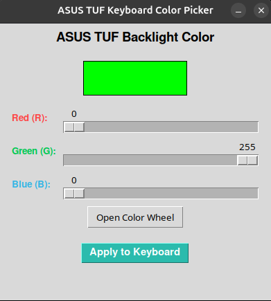

# ASUS TUF Keyboard Color Picker 🎨

A simple Python Tkinter GUI tool to change the keyboard backlight color on ASUS TUF Gaming laptops running Linux (Ubuntu/Debian). It writes directly to the native `asus-nb-wmi` driver kernel interface.



## Features
- 🎛️ Interactive **RGB Sliders** for precise color matching.
- 🎨 Integration with the native OS **Color Wheel / Palette**.
- 👁️ Live visual preview box before applying changes.

## Prerequisites & Installation

1. **Ubuntu/Debian Dependencies:**
   Ubuntu does not include Tkinter by default. Install it via terminal:
   ```bash
   sudo apt update
   sudo apt install python3-tk
   ```

2. **Clone the Repository:**
   ```bash
   git clone https://github.com/ShamrockD/asus_tuf_keyboard_backlight_linux.git
   cd asus_tuf_keyboard_backlight_linux
   ```

## Usage

Because Linux restricts direct modifications to hardware driver files (`sysfs`), you **must** run the script with root privileges:

```bash
sudo python3 tuf_color_picker.py
```

## Supported Hardware
Tested on **ASUS TUF Gaming A15 (FA506NC)** running Ubuntu 24.04 LTS, Ubuntu 26.04.1 LTS. Should work on any ASUS laptop that exposes the backend driver at `/sys/devices/platform/asus-nb-wmi/leds/asus::kbd_backlight/kbd_rgb_mode`.

## License
Distributed under the **GNU General Public License v3.0 (GPL-3.0)**. See the `LICENSE` file for more details.